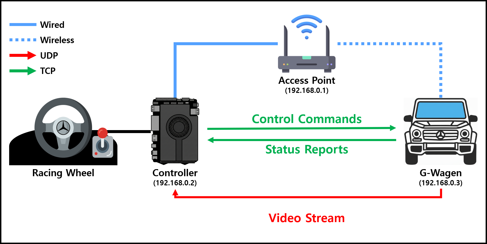
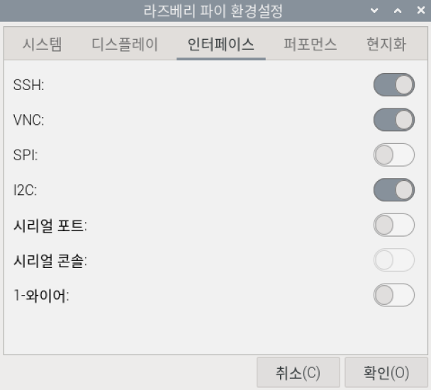

# 떡상한 구독자 수! 바로 G바겐 뽑았습니다
<div align="center">
  <a href="https://www.youtube.com/watch?v=YYdsRcfBJVY">
    
  </a>
</div>

---

## 1. System Architecture


- **Video Stream**
    - **Protocol:** UDP
        - **Port:** 5000
    - **Codec:** MJPEG
    - **Resolution:** 1920x1080
    - **Frame Rate:** 15 fps
    - **Format:** Inline
- **Control Commands**
    - **Protocol:** TCP
        - **Port:** 5001
    - **Payload:** Steering Value, Steering Direction, Acceleration Percent, Brake Percent, Gear, Headlight, Hazard Light, Horn
- **Status Reports**
    - **Protocol:** TCP
        - **Port:** 5001
    - **Payload:** Battery SoC (State of Charge)
- **Access Point** 
    - **SSID (Service Set ID):** `Mercedes-Benz`
    - **PSK (Pre-Shared Key):** `20220608`


---


## 2. Hardware Information
### 2.1) G-Wagen
- **Main Board:** Raspberry Pi Zero 2 W
    - **Processor:** Broadcom BCM2710A1, quad-core 64-bit SoC (Arm Cortex-A53 @ 1GHz)
    - **Memory:** 512MB LPDDR2
    - **Storage:** 16GB microSD Card
    - **[Product Brief](./resources/[Raspberry%20Pi%20Zero%202%20W]%20Product%20Brief.pdf)**
- **Camera:** Raspberry Pi Camera Module V2 (8MP)
- **Motor Driver:** L9110S Dual H-Bridge
- **Speaker:** LM386 Audio Amplifier
- **Battery**
    - **Capacity:** 5000mAh (3.7V)
    - **Fuel Gauge:** Gravity 3.7V Li Battery Fuel Gauge SKU DFR0563
        - **Link:** [https://wiki.dfrobot.com/gravity__3.7v_li_battery_fuel_gauge_sku__dfr0563](https://wiki.dfrobot.com/gravity__3.7v_li_battery_fuel_gauge_sku__dfr0563)
    - **Management IC:** IP5306 (Li-ion Charge/Boost Controller)
- **Circuit Diagram**<br>
    
### 2.2) Controller
- **Main Board:** LattePanda Sigma
    - **Processor:** Intel Core i5-1340P 12 Cores, 16 Threads Up to 4.6GHz
    - **Graphics:** Intel Iris Xe Graphics 80 Execution Units Up to 1.45GHz
    - **Memory:** 16GB Dual Channels LPDDR5 6400MHz
    - **Storage:** 512GB NVMe SSD
    - **Specification:** [https://docs.lattepanda.com/content/sigma_edition/Specification/](https://docs.lattepanda.com/content/sigma_edition/Specification/)
- **Racing Wheel:** [POWER RACER 270R REVOLUTION](./resources/[POWER%20RACER%20270R%20REVOLUTION]%20manual.pdf)


---


## 3. Software Information
### 3.1) G-Wagen
- **Operating System:** Raspberry Pi OS with Desktop (64-bit)
    - **Debian Codename:** Bookworm (Version 12)
    - **Download Link:** [https://downloads.raspberrypi.org/raspios_arm64/images/raspios_arm64-2025-05-13/](https://downloads.raspberrypi.org/raspios_arm64/images/raspios_arm64-2025-05-13/)
- **Language & Libraries**
    - 
        - 
- **Account Information**
    - **username:** `gwagen`
    - **password:** `0608`
### 3.2) Controller
- **Operating System:** Ubuntu with Desktop (64-bit)
    - **Debian Codename:** Noble Numbat (Version 24.04.3 LTS)
    - **Download Link:** [https://releases.ubuntu.com/noble/](https://releases.ubuntu.com/noble/)
- **Language & Libraries**
    - 
        -  
- **Account Information**
    - **username:** `controller`
    - **password:** `0608`


---


## 4. Setup Instructions
### 4.1) G-Wagen
#### 4.1.1) Raspberry Pi Configuration
- **Interfaces**    
    
    - **SSH (Secure Shell) Enabled**
    - **VNC (Virtual Network Computing) Enabled**
    - **I2C (Inter-Integrated Circuit) Enabled**
#### 4.1.2) System Update
- **Update Package List**
    ```bash
    sudo apt update
    ```
- **Upgrade Installed Packages**
    ```bash
    sudo apt upgrade -y
    ```
#### 4.1.3) Install Libraries
##### 4.1.3.1) System Dependencies and Core Packages (APT)
- **Install Required Packages**
    ```bash
    sudo apt install -y pigpio
    ```
    - **pigpio:** C library for Raspberry Pi which allows control of the General Purpose Input Outputs (GPIO)
##### 4.1.3.2) Specific Python Modules (pip3)
- **Install Required Python Modules**
    ```bash
    sudo pip3 install smbus2==0.5.0 --break-system-packages
    ```
    - **smbus2:** Pure Python implementation for I2C protocol communication
        - `--break-system-packages`: Allows installation of packages that may conflict with system packages
#### 4.1.4) Enable pigpio Daemon
- **Enable and Start pigpiod Service**
    ```bash
    sudo systemctl enable --now pigpiod
    ```
    - **systemctl:** Command to examine and control the systemd system and service manager
        - `--now`: Start the service immediately
### 4.2) Controller
#### 4.2.1) System Update
- **Update Package List**
    ```bash
    sudo apt update
    ```
- **Upgrade Installed Packages**
    ```bash
    sudo apt upgrade -y
    ```
#### 4.2.2) Install Libraries
##### 4.2.2.1) System Dependencies and Core Packages (APT)
- **Install Required Packages**
    ```bash
    sudo apt install -y python3-pip python3-opencv python3-pygame
    ```
    - **python3-pip:** Package installer for Python 3
    - **python3-opencv:** Library of programming functions primarily for real-time computer vision tasks
    - **python3-pygame:** Set of Python modules designed for writing video games
##### 4.2.2.2) Specific Python Modules (pip3)
- **Install Required Python Modules**
    ```bash
    sudo pip3 install pyinstaller --break-system-packages
    ```
    - **pyinstaller:** Tool to bundle Python applications into standalone executables
        - `--break-system-packages`: Allows installation of packages that may conflict with system packages


---


## 5. Start Video Stream on G-Wagen
- **Run rpicam-vid Command**
    ```bash
    rpicam-vid -t 0 --width 1920 --height 1080 --framerate 15 --codec mjpeg --inline --nopreview -o udp://192.168.0.2:5000
    ```
    - **rpicam-vid:** Command-line tool for streaming video from the Raspberry Pi Camera Module
        - `-t:` Duration of the video stream
        - `--width:` Width of the video frame
        - `--height:` Height of the video frame
        - `--framerate:` Frames per second
        - `--codec:` Video codec to use
        - `--inline:` Embed JPEG frames directly in the stream
        - `--nopreview:` Disable preview window
        - `-o:` Output destination


---


## 6. Auto-start G-Wagen Services on Boot
### 6.1) Create RPi Camera Video Stream Service
- **Open the file using a text editor**
    ```bash
    sudo vi /etc/systemd/system/rpicam.service
    ```
    - **Add the following content**
        ```ini
        [Unit]
        Description=RPi Camera Video Stream
        Wants=network-online.target
        After=network-online.target
        
        [Service]
        User=gwagen
        Group=gwagen
        Type=simple
        WorkingDirectory=/home/gwagen
        ExecStart=/usr/bin/rpicam-vid -t 0 --width 1920 --height 1080 --framerate 15 --codec mjpeg --inline --nopreview -o udp://192.168.0.2:5000
        Restart=on-failure
        RestartSec=5

        [Install]
        WantedBy=multi-user.target
        ```
        - **[Unit] Section**
            - `Description`: Brief description of the service
            - `Wants`: Specifies the target that this service wants to be started with
            - `After`: Specifies the order in which units are started
        - **[Service] Section**
            - `User`: User to run the service as
            - `Group`: Group to run the service as
            - `Type`: Specifies the process start-up type
            - `WorkingDirectory`: Directory where the service will run
            - `ExecStart`: Command to start the service
            - `Restart`: Defines the restart behavior on failure
            - `RestartSec`: Delay before restarting the service
        - **[Install] Section**
            - `WantedBy`: Specifies the target that this service should be started under
### 6.2) Create G-Wagen Application Service
- **Open the file using a text editor**
    ```bash
    sudo vi /etc/systemd/system/gwagen.service
    ```
    - **Add the following content**
        ```ini
        [Unit]
        Description=G-Wagen Application
        Wants=network-online.target
        After=network-online.target
        After=rpicam.service
        
        [Service]
        User=gwagen
        Group=gwagen
        Type=simple
        WorkingDirectory=/home/gwagen
        ExecStart=/usr/bin/python3 /home/gwagen/main.py
        Restart=on-failure
        RestartSec=5

        [Install]
        WantedBy=multi-user.target
        ```
        - **[Unit] Section**
            - `Description`: Brief description of the service
            - `Wants`: Specifies the target that this service wants to be started with
            - `After`: Specifies the order in which units are started
        - **[Service] Section**
            - `User`: User to run the service as
            - `Group`: Group to run the service as
            - `Type`: Specifies the process start-up type
            - `WorkingDirectory`: Directory where the service will run
            - `ExecStart`: Command to start the service
            - `Restart`: Defines the restart behavior on failure
            - `RestartSec`: Delay before restarting the service
        - **[Install] Section**
            - `WantedBy`: Specifies the target that this service should be started under
### 6.3) Enable Both Services
- **Reload Systemd Daemon**
    ```bash
    sudo systemctl daemon-reload
    ```
- **Enable both services to start on boot**
    ```bash
    sudo systemctl enable rpicam.service gwagen.service
    ```
- **Start both services immediately**
    ```bash
    sudo systemctl start rpicam.service gwagen.service
    ```
- **Check the status of both services**
    ```bash
    sudo systemctl status rpicam.service gwagen.service
    ```
### 6.4) Apply Changes
- **Apply Changes by Rebooting**
    ```bash
    sudo reboot
    ```


---


## 7. Build Controller Application Executable
- **Use PyInstaller to Create Executable**
    ```bash
    pyinstaller --onedir --noconsole --name controller main.py
    ```
    - **pyinstaller:** Tool to bundle Python applications into standalone executables
        - `--onedir:` Create a directory with the executable and dependencies
        - `--noconsole:` Do not provide a console window for standard i/o
        - `--name:` Specify the name of the executable file